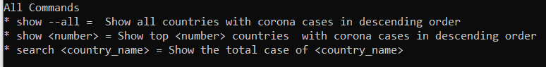

# Corona-Case-Tracker-CLI
I developed this program by using BeautifulSoup and requests modules in python. As a result for running this program you must load these modules. This program shows  all corona cases numbers in the countries. This program is executed from terminal. You can see all valid arguments by typing :  
>\>py corona_case_tracker.py help  

The code above prints all valid arguments which can be used together for running this program in the terminal. The code above prints to the terminal:  

Note= If you run this with program search argument, the searching happens  in case insensitive (e.g China and ChINa are treated as the same).
